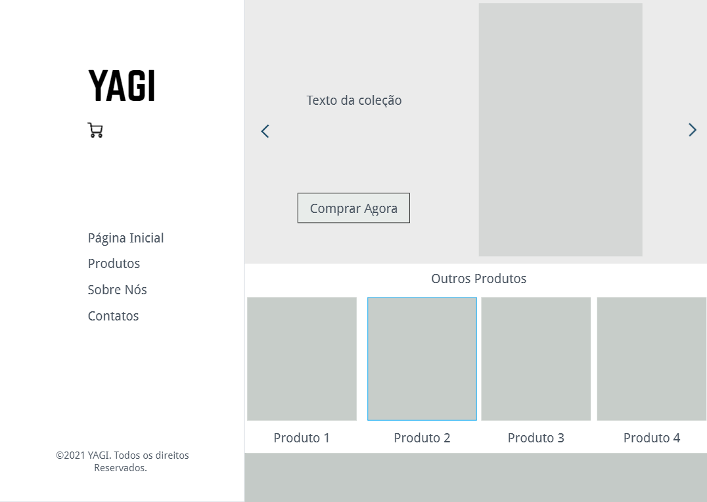
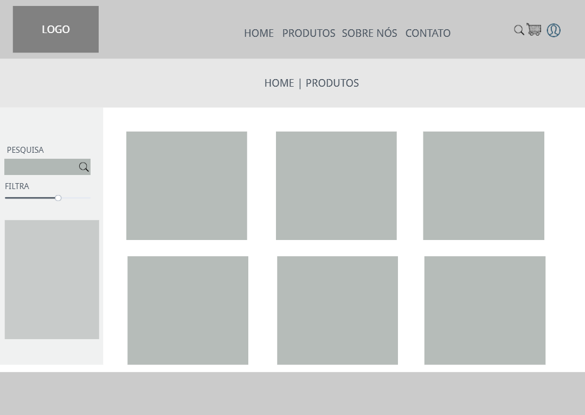
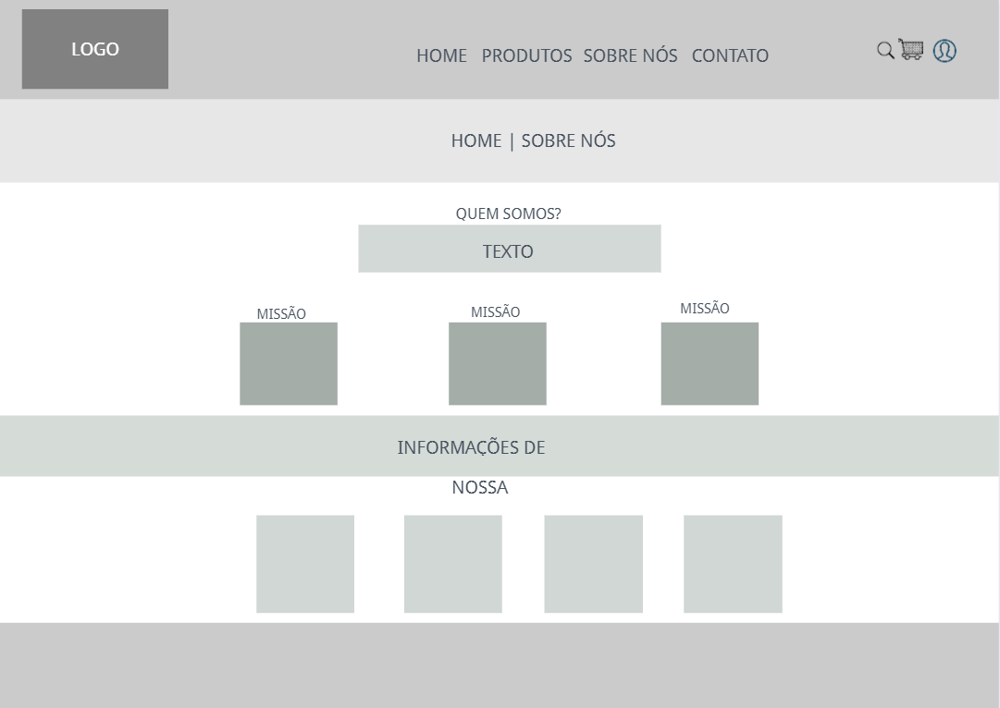
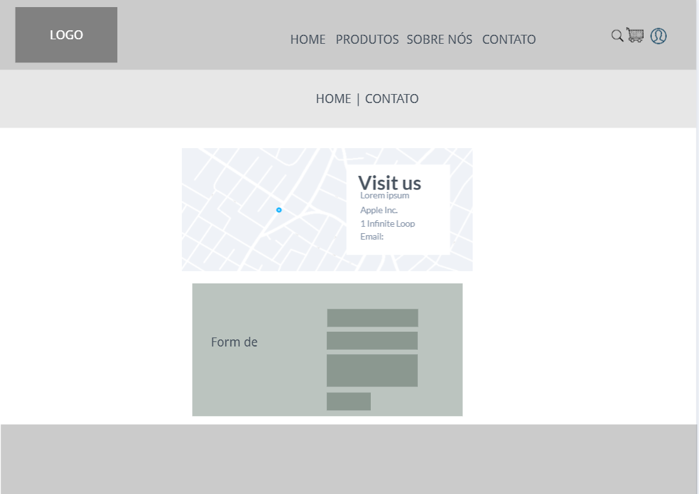
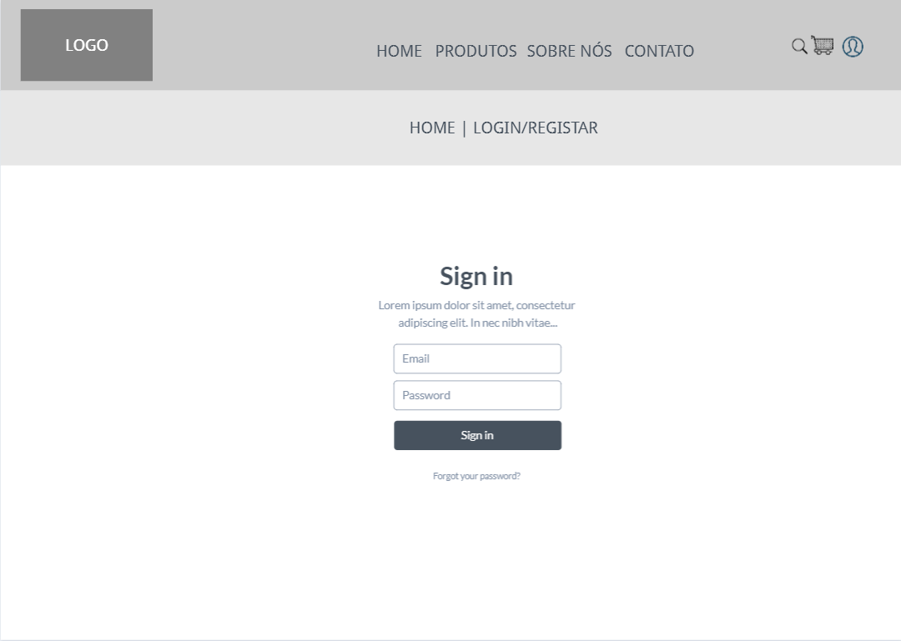
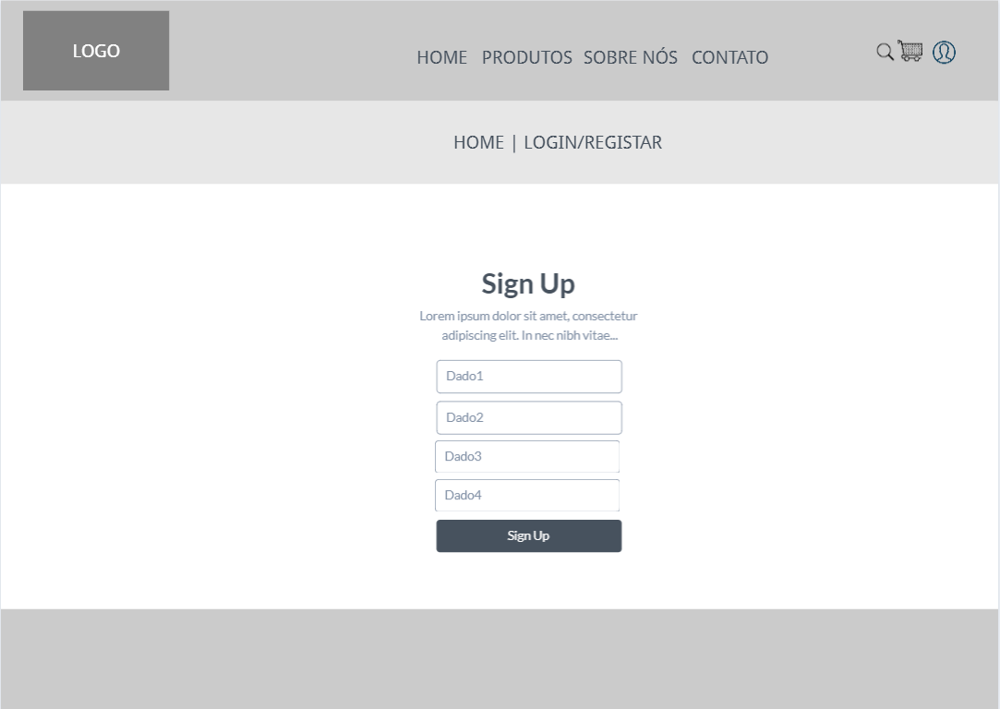
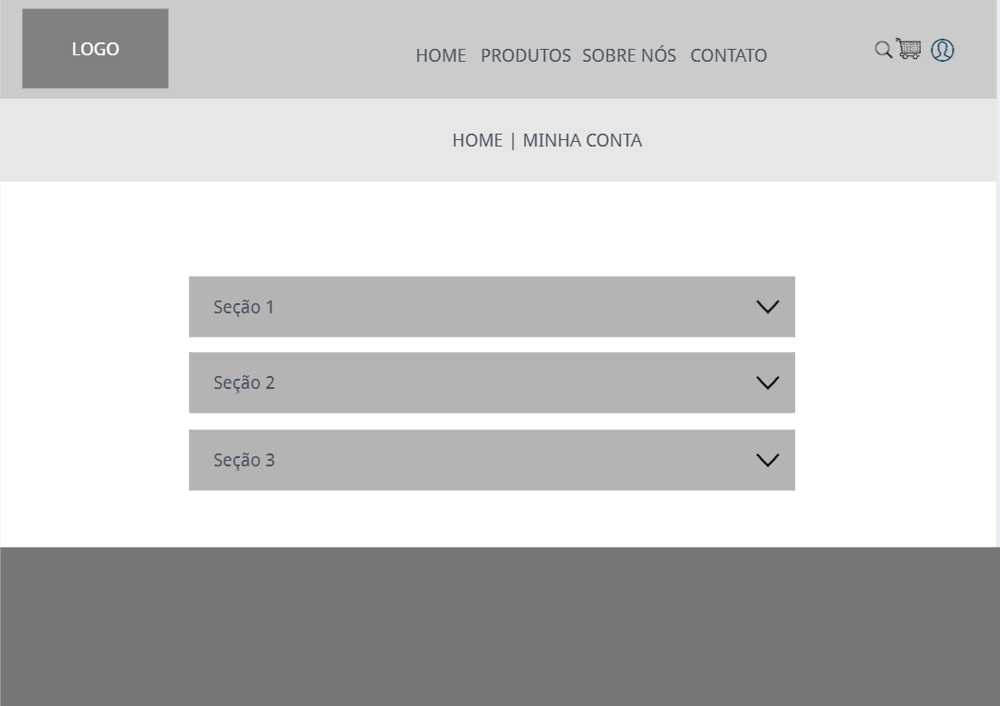

# YAGI – E-commerce de Sneakers

**João Pedro de Castro, email**

**João Victor dos Santos, joao.santos.1130758@pucminas.sga.br**

**Pedro Assis Corrêa, pedro.correa1101@gmail.com**

**Wyan Gauzzi, email**

---

_Curso de Ciência da Computação, Unidade {Coração Eucarístico}_

_Instituto de Informática e Ciências Exatas – Pontifícia Universidade de Minas Gerais (PUC MINAS), Belo Horizonte – MG – Brasil_

---

_**Resumo**_ 
_Considerando a atual situação dos e-commerces, que não garantem a autenticidade dos produtos e aplicam preços exorbitantes, foi de interesse da equipe montar um site que garanta ao consumidor que na plataforma, ele estará seguro às inseguranças citadas anteriormente. Tal processo é garantido a partir da análise de profissionais no ramo da moda, que garantirão a alta qualidade e autenticidade dos produtos disponibilizados._

---

## 1.Introdução 

	1.1 Contextualização
No país em que vivemos, o acesso a informações confiáveis é muitas vezes dificultado. Este pode ser um problema em contextos diversos, dentre eles na compra de produtos online, tendo em vista que muitos dos interessados nas compras não pesquisam o necessário para se certificar dos produtos que estão comprando.
As redes sociais, desde que se tornaram de fácil acesso para grande maioria da população, se tornaram uma ótima opção para divulgação do comércio online, pois é possível atingir milhões de pessoas com apenas uma publicação. Com o advento da pandemia, ainda mais páginas desse ramo foram surgindo, porém, o preocupante é que há uma falsa afirmação de que os produtos vendidos são realmente verdadeiros, pode-se notar pela grande quantidade em estoque de produtos de difícil acesso e a grande variedade de preços de um mesmo produto.
Desta forma, o sistema de marketplace da YAGI, construído pela equipe, tem por objetivo garantir a autenticidade dos produtos listados no site, além da prática do preço justo sobre os produtos.

	1.2 Problema
Estresse, desconfiança e frustração. Esses são três sentimentos, em muitos casos, constantes no cotidiano de consumidores e fornecedores, ao estabelecer contato e realizar negociações. Inicialmente, é importante evidenciar a dificuldade, para muitas pessoas, em encontrar sites confiáveis e, acreditar que aquele está aplicando um preço justo, comparado ao real valor do produto. É importante, também, verificar o histórico no mercado, analisar o que outros clientes falam sobre ele e seus produtos. Assim, é possível concluir que o trabalho para o consumidor (loja ou pessoa física), é enorme e exige dedicação e tempo.
Já ao fornecedor, o trabalho pode parecer mais, porém, com o grande aumento da pirataria, fica cada vez mais difícil de se comprovar que de fato o seu produto é verdadeiro e que o preço praticado por ele, segue os maiores sites de revenda de sneakers do mundo, à exemplo o GOAT.
	
	1.3 Objetivo Geral
-	Frente ao problema citado, procurou-se utilizar os recursos tecnológicos à disposição para criar um ambiente online que pudesse garantir a venda segura de sneakers. Ademais, empenhar-se na tarefa de garantir a autenticidade dos produtos listados no site.

- 	Facilitar a visualização, disposição dos produtos e,respectivamente, os preços fornecidos pelos vendedores.

- 	Permitir, a partir dos dados disponibilizados, a melhor opção de compra para os cidadãos.

	1.4 Justificativas

Considerando que muitos consumidores são enganados diariamente por lojas e páginas que dizem vender produtos originais, a equipe propôs-se a buscar soluções para que possam garantir a segurança e satisfação do consumidor, assim realizando a criação de um marketplace utilizando do conhecimentos acerca da área de desenvolvimento de software, sistemas inteligentes e banco de dados que os participantes possuem.

## 2. Projeto da Solução

	2.1. Requisitos Funcionais

A tabela a seguir apresenta os requisitos do projeto, identificando a prioridade de cada um.

|No.	            |Descrição	   		                                       | Prioridade  |
| :---------------: | :-----------------------------------------------------------	       | :-------------:|
| RF-01	 | Consultar os sneakers disponíveis 		       | Alta	     |		
| RF-02           | Listar os sneakers		         		       | Alta	     | 
| RF-03           | Login e cadastro de usuários         		       | Alta	     |  
| RF-04	 | Chatbot para pesquisas 		     	                  | Média        |
| RF-05	 | Identificação dos analistas	     	                  | Média        |
| RF-06	 | Identificação dos vendedores no produto listado   | Baixo	     |
| RF-07	 | Envio de e-mails com promoções   		       | Baixo	     | 

	2.2. Requisitos não Funcionais

A tabela a seguir apresenta os requisitos não funcionais do projeto e suas prioridades indicadas.

|No.	            |Descrição	   		                                          | Prioridade  |
| :---------------: | :-----------------------------------------------------------	          | :-------------:|
| RNF-01	 | O site está acessível na plataforma **** 	          | Alta	        |
| RNF-02        | O site é compatível com os principais navegadores | Alta	        | 
| RNF-03        | O site é responsivo		         		          | Média        |  

## 3. Metodologia

Este tópico aborda as definições de ferramentas utilizadas pela equipe, tanto para a manutenção dos códigos e demais artefatos, quanto para a organização do time na execução das tarefas propostas pela equipe.

	3.1. Tecnologias e ambientes de trabalho

Com relação à gestão do código fonte, o grupo de desenvolvimento, após fazer suas alterações no projeto, faz a commit na branch master do repositório do GitHub. Após a confirmação de sucesso e isenção de falhas nessa commit, é feito o push para o ******(site), pelo qual será exibido o site ao usuário final.
Estão listadas abaixo as tecnologias, ferramentas e ambientes utilizados para o desenvolvimento do projeto YAGI especificadas por finalidade e utilização:
-	Linguagens de desenvolvimento web front-end: HTML, CSS e JavaScript;
-	Linguagens de desenvolvimento back-end: Java;
-	Repositório: GitHub;
-	Frameworks: Spark;
-	Integração BD com o site: Eclipse, Maven;
-	Banco de dados: PostgreSQL;
-	IDE web: Microsoft Visual Studio Code;
-	Microsoft Azure como servidor em nuvem para o ChatBot;
-	QnA Maker para reunir e formular perguntas e respostas do ChatBot. (depende do nosso chatbot).

Como citado acima, para o desenvolvimento base de nossa aplicação web foram utilizadas linguagens de front-end e back-end através do Microsoft Visual Studio Code, montando uma aplicação com diversas páginas e funcionalidades. A partir disso, foi possível integrar as informações dos usuários com o banco de dados da YAGI no PostgreSQL através da Eclipse e Maven. Além disso, foram utilizadas a plataforma Microsoft Azure como base para a criação do ChatBot.

	
	
	3.2. Fluxo de publicação (fazer depois)

Fazer ainda

	3.3 Telas do sistema (fazer depois)

## 4.Modelagem de Dados

Para o funcionamento da aplicação, foi necessário uma estrutura que comportasse os dados dos usuários e os respectivos processos pelos quais cada usuário passa até a realização da compra.

	4.1 Diagrama Pé de Galinha

O diagrama abaixo ilustra a estrutura base para o funcionamento do nosso sistema. Nele podemos observar que USUÁRIO e PRODUTOS são interligados entre a entidade COMPRA_VENDA. Em que um usuário pode realizar n compras ou vendas, enquanto apenas um produto pode participar dessa relação.
A entidade USUÁRIO é a mais genérica, possuindo a chave primária de CPF, e a partir disso, ela se subdivide em VENDEDOR, COMPRADOR ou ANALISTA, cada um com seus respectivos papéis dentro do sistema.

## 5. Serviços Inteligentes

## 6.Gerenciamento de Projeto

A equipe se organizou por meio da ferramenta Kaban disponibilizada na plataforma Trello.

Utilizando do método Scrum combinado ao Kaban, a organização do grupo dispõe-se da seguinte forma:

|Equipe	                |Função 	       | 
| :---------------:     | :--------------------|
| João Victor dos Santos| Analista de Negócios |
| João Pedro de Castro  | Desenvolvedor	       | 
| Pedro Assis Corrêa    | Gerente de Projetos  |
| Wyan Gauzzi           | Cientista de Dados   |

## 7. Avaliação

Os registros abaixo foram efetuados após alguns usuários navegarem pela plataforma. O intuito dessa ação era medir a satisfação com o sistema e a facilidade dele:

|Usuários               |Resgistros 	       	    						| 
| :---------------:     | :---------------------------------------------------------------------|
| Usuário01		| “O site é bem intuitivo.” 						|
| Usuário02		| “Gostei que o site possui um chatbot.”				| 
| Usuário03		| “O sistema é de fácil manuseio e possui um layout bonito.”		|
| Usuário04		| “Tive muita facilidade em achar tudo o que eu procurava, ótimo site.” |

## 8. Conclusões
A experiência de desenvolvimento da plataforma YAGI exigiu conhecimentos prévios sobre banco de dados, desenvolvimento web e criação de sistemas inteligentes. Alguns aspectos foram desafiadores, contudo, o resultado do nosso sistema nos parece satisfatório, já que cumpre os requisitos exigidos.
A última versão do projeto foi divulgada em **link_site**.	
   
